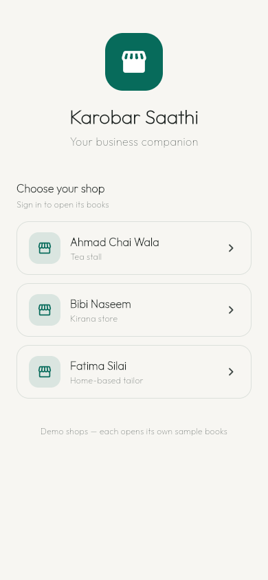
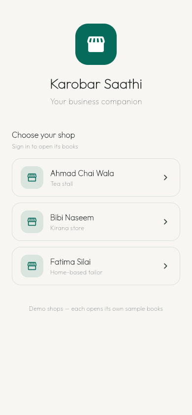
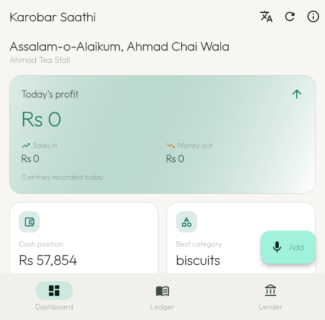
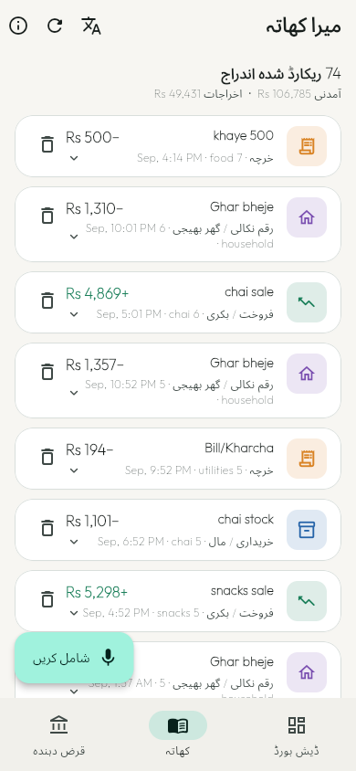
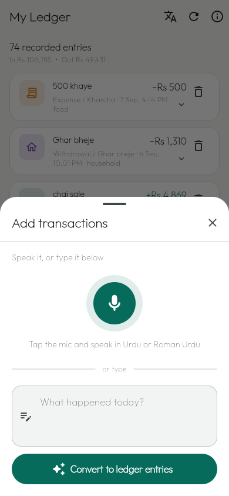
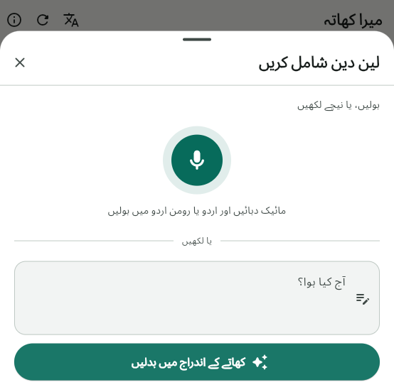
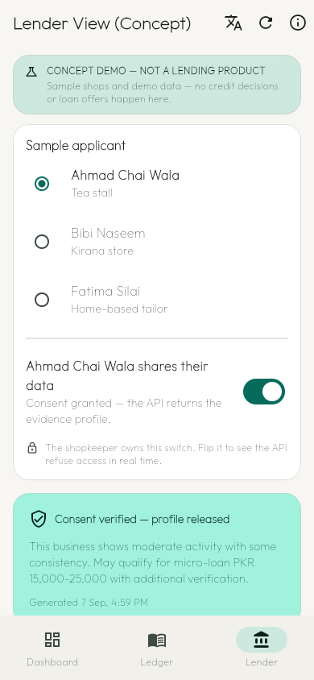

<p align="center">
  
</p>

<h1 align="center">Karobar Saathi</h1>

<p align="center">
  <strong>Spoken transactions → confirmed ledger → explainable financial evidence</strong><br/>
  For Pakistani informal micro-businesses.
</p>

<p align="center">
  <a href="https://github.com/ahsankhizar5/karobar-saathi/actions/workflows/ci.yml">
    
  </a>
  <a href="https://github.com/ahsankhizar5/karobar-saathi/releases/latest">
    
  </a>
  <a href="LICENSE">
    
  </a>
  <a href="https://ahsankhizar5.github.io/karobar-saathi">
    
  </a>
</p>

<p align="center">
  <a href="https://github.com/ahsankhizar5/karobar-saathi/releases/latest">
    
  </a>
</p>

<p align="center">
  
</p>
<p align="center"><em>Voice note → parsed entry → confirmed ledger</em></p>

> **This is a working proof-of-concept, not a production product.** Read the [production-readiness caveats](#production-readiness-caveats) before judging it as one.

## What it does

Karobar Saathi lets a shopkeeper record daily sales, purchases, expenses, and withdrawals by **speaking in Urdu or Roman Urdu**. The app turns that voice note into a structured ledger entry, asks for confirmation when something is unclear, and builds a simple dashboard with profit, trends, and a cash-flow insight.

A separate **consent-gated evidence API** lets lenders or partners request the same financial summary — but only if the shopkeeper has explicitly allowed it.

## Quick links

| Link | URL |
|------|-----|
| **Download APK** | [GitHub Releases](https://github.com/ahsankhizar5/karobar-saathi/releases/latest) |
| **Interactive Presentation** | [presentation.html](presentation.html) ([Live Deck](https://ahsankhizar5.github.io/karobar-saathi/presentation.html)) |
| **API homepage** | [ahsankhizar5.github.io/karobar-saathi](https://ahsankhizar5.github.io/karobar-saathi) |
| **Live API** | [karobar-saathi.onrender.com](https://karobar-saathi.onrender.com) |
| **Offline URL card** | [docs/offline.html](https://ahsankhizar5.github.io/karobar-saathi/offline.html) |

## Screenshots

| Login | Dashboard | Ledger |
|-------|-----------|--------|
|  |  |  |

| Add transaction (English) | Add transaction (Urdu) | Lender view |
|---------------------------|------------------------|-------------|
|  |  |  |

## What's real vs. demo

**Fully working**
- Voice-to-ledger pipeline: voice note → Whisper transcription → LLM/rule parsing → confirmed ledger.
- Typed transaction parsing with confirmation and clarification questions.
- Dashboard with profit, 7-day trend, cash position, and a generated business insight.
- Consent-gated evidence endpoint `/api/v1/evidence-profile/{user_id}`.
- Bilingual English/Urdu UI with full RTL layout.
- Login screen and WhatsApp-style voice recording feedback.

**Demo-simulated**
- Lender view shows three seeded demo shops, not real applicants.
- "Financial readiness" is a rule-based heuristic, not trained on real repayment outcomes.
- No actual MFB/NBFC partner is connected.

## Project layout

- `karobar_saathi/` — Flutter Android app (Riverpod, `record`)
- `backend/` — FastAPI service (voice parsing, ledger, dashboard, evidence API)
- `backend/seed_audio/` — pre-recorded voice notes for repeatable voice-pipeline demos
- `docs/` — API homepage, offline URL card, and verification logs
- `.github/workflows/` — CI and release automation
- `render.yaml` / `Dockerfile` — Render deployment configuration

## Local backend setup

1. Install Python 3.11 and FFmpeg.
2. Create a virtual environment and install dependencies:

   ```bash
   cd backend
   python -m venv .venv
   .venv\Scripts\activate
   pip install -r requirements.txt
   ```

3. Copy `.env.example` to `.env` and add a Groq-compatible LLM API key.
4. Start the API:

   ```bash
   uvicorn app.main:app --host 0.0.0.0 --port 8000
   ```

The first start creates SQLite data and seeds three demo profiles.

## Run the Flutter app

```bash
cd karobar_saathi
flutter pub get

# Android emulator against local backend
flutter run --dart-define=API_BASE_URL=http://10.0.2.2:8000

# Physical phone against a deployed backend
flutter run --dart-define=API_BASE_URL=https://karobar-saathi.onrender.com
```

## Deploy the backend

The included `render.yaml` deploys the Docker service to Render. Set `LLM_API_KEY` and `SECRET_KEY` only in Render's encrypted environment panel; do not add them to the repository. Voice transcription uses Groq's hosted Whisper API (`whisper-large-v3`) with the same `LLM_API_KEY`.

The free-tier SQLite directory is ephemeral — after a service restart the demo data resets.

<details>
<summary><strong>Build & release the APK</strong></summary>

Build only after deploying the backend, so the APK does not point to localhost.

1. Generate a local signing key:

   ```bash
   keytool -genkeypair -v -keystore C:/Users/you/karobar-saathi-release.jks -alias karobar-saathi -keyalg RSA -keysize 2048 -validity 10000
   ```

2. Create `karobar_saathi/android/key.properties` with the matching passwords and key location. Both files are ignored by Git and must never be shared.
3. Build:

   ```bash
   cd karobar_saathi
   flutter build apk --release --dart-define=API_BASE_URL=https://karobar-saathi.onrender.com
   ```

4. Create a Git tag `vX.Y.Z` and attach `build/app/outputs/flutter-apk/app-release.apk` to the release.

</details>

## Evidence API

```bash
curl -H "X-User-Consent: true" \
  https://karobar-saathi.onrender.com/api/v1/evidence-profile/shop_001
```

Revoking consent in the app (or via `PATCH /api/v1/evidence-profile/{user_id}/consent`) makes the same request return HTTP `403`.

<details>
<summary><strong>Production-readiness caveats</strong></summary>

- **Cold starts.** The backend runs on Render's free tier and sleeps after ~15 minutes of inactivity. The first request after idle can take up to about a minute.
- **Ephemeral demo data.** Storage is SQLite on the service's ephemeral disk. Each deploy or restart resets everything back to the three seeded demo profiles.
- **Shared demo identity.** The shopkeeper side of the app is hard-wired to a single demo user (`shop_001`), so everyone who installs the APK sees and edits the same ledger.
- **Free-tier limits.** Voice transcription and LLM parsing run on a free-tier API key; sustained use can hit rate limits.
- **No real lending.** The lender view shows seeded demo shops with rule-based heuristics. No credit decisions or lender integrations exist.
- **Sideloading only.** The APK is distributed via GitHub Release, so Android shows an unknown-sources warning during install.

</details>

## Verification, changelog, and license

- End-to-end verification logs: [`docs/VERIFICATION.md`](docs/VERIFICATION.md)
- Release history: [`CHANGELOG.md`](CHANGELOG.md)
- License: [`LICENSE`](LICENSE) (MIT)
- The app uses the [Outfit](karobar_saathi/assets/fonts/OFL.txt) font under the SIL Open Font License.
